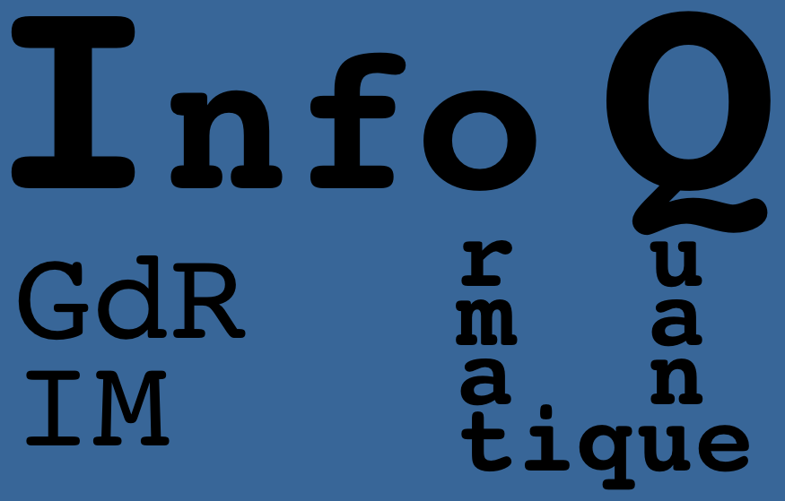
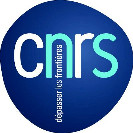

# Journées du groupe Informatique Quantique 2019

## 28 et 29 Novembre 2019 - Besançon

Les Journées Informatique Quantique sont organisées par le groupe de travail Informatique Quantique ([GT_IQ](https://members.loria.fr/SPerdrix/gt-iq/)) du [GdR IM](https://www.gdr-im.fr/) du CNRS. Elles se dérouleront au laboratoire [FEMTO-ST](https://www.femto-st.fr/fr) à Besançon.

### Présentation

Les Journées Informatique Quantique ont pour but de rassembler la communauté travaillant dans les différents domaines que recouvre l'informatique quantique. Une série d'exposés permettra de prendre connaissance des travaux des participants. Les jeunes chercheurs, tout particulièrement les doctorants et post-doctorants, sont vivement encouragés à présenter leurs résultats récents ou travaux en cours.

### Soumission

Merci d'envoyer un titre et un abstract d'une demi-page au format PDF aux organisateurs: [Henri de Boutray](https://www.femto-st.fr/en/femto-people/hdeboutr), [Alain Giorgetti](http://members.femto-st.fr/alain-giorgetti/), [Frédéric Holweck](https://utbmfh.pagesperso-orange.fr/) et [Pierre-Alain Masson](http://members.femto-st.fr/pierre-alain-masson/)

### Inscription

L'inscription est gratuite mais obligatoire par e-mail aux organisateurs avant le \[TODO : insérer date\].

### Dates importantes

 * \[TODO : insérer date\]: date limite de soumission.
 * \[TODO : insérer date\]: notifications d’acceptation.
 * \[TODO : insérer date\]: date limite d’inscription.
 * \[TODO : insérer date\]: journées informatique quantique à FEMTO-ST.

### Programme

\[TODO : insérer programme\]

### Informations Pratiques

Les journées se dérouleront au laboratoire FEMTO-ST, salle \[TODO : insérer salle\]. 

Comment y venir à FEMTO-ST ? \[TODO : insérer lien\]
Où se loger ? \[TODO : insérer lien\]

#### Organisateurs

[Henri de Boutray](https://www.femto-st.fr/en/femto-people/hdeboutr), [Alain Giorgetti](http://members.femto-st.fr/alain-giorgetti/), [Frédéric Holweck](https://utbmfh.pagesperso-orange.fr/) et [Pierre-Alain Masson](http://members.femto-st.fr/pierre-alain-masson/)

   
