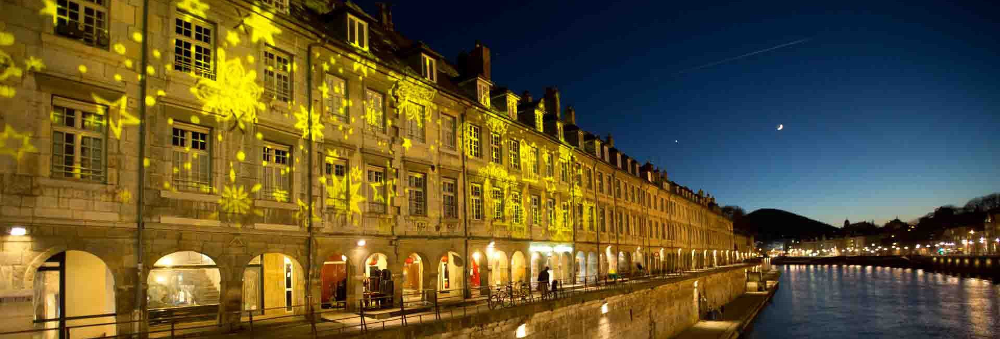

## Journées Informatique Quantique 2019

### 28 et 29 Novembre 2019 - Besançon

Les Journées Informatique Quantique sont organisées par le groupe de travail Informatique Quantique ([GT_IQ](https://members.loria.fr/SPerdrix/gt-iq/)) du [GdR IM](https://www.gdr-im.fr/) du CNRS. Elles se dérouleront à l'institut [FEMTO-ST](https://www.femto-st.fr/fr) à Besançon.

### Présentation

Les Journées Informatique Quantique ont pour but de rassembler la communauté travaillant dans les différents domaines que recouvre l'informatique quantique. Une série d'exposés permettra de prendre connaissance des travaux des participants. Les jeunes chercheurs, tout particulièrement les doctorants et post-doctorants, sont vivement encouragés à présenter leurs résultats récents ou travaux en cours.

### Soumission et inscription

L’inscription est gratuite mais obligatoire, avant le 5 novembre 2019.

L'inscription et la proposition d'exposé se font sur le formulaire suivant : [https://forms.gle/DDh37Wy97u7jRGPD7](https://forms.gle/DDh37Wy97u7jRGPD7)

<!--### Dates importantes

 * \[TODO : insérer date\]: date limite de soumission.
 * \[TODO : insérer date\]: notifications d’acceptation.
 * \[TODO : insérer date\]: date limite d’inscription.
 * \[TODO : insérer date\]: journées informatique quantique à FEMTO-ST.

### Programme

\[TODO : insérer programme\]

### Informations pratiques

Les journées se dérouleront au laboratoire FEMTO-ST, salle \[TODO : insérer salle\]. 

Comment y venir à FEMTO-ST ? \[TODO : insérer lien\]
Où se loger ? \[TODO : insérer lien\]-->

### Organisateurs

Henri de Boutray, Alain Giorgetti, Frédéric Holweck et Pierre-Alain Masson.

### Contact

pierre-alain.masson\[at\]femto-st.fr

   
